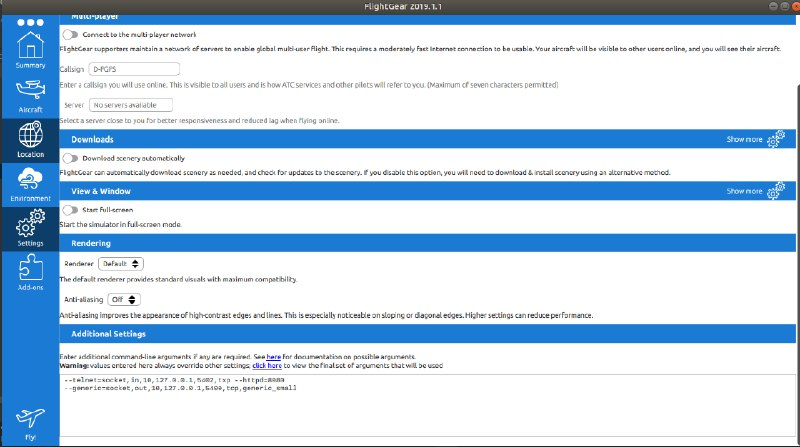
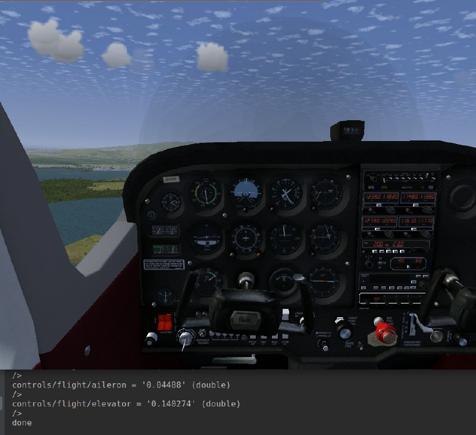

# ‫‪Flight Simulator Interpreter :airplane: 
> This is our simple and well planned interpreter for the flightgear simulator.

## Table of contents
* [General info](#general-info)
* [More about the project](#more-about-the-project)
* [Screenshots](#screenshots)
* [Setup](#setup)
* [Status](#status)

## General info
This project enable you to control the flight simulator by sending flying commands to the simulator and 
get info of the flight path simulator.  isn't it exsiting? 

## More about the project
The program first lexer the script it was giving to her, then parses it and execute each command. 
Meanwhile, the programs opens a server in another thread which stores data from the simulator(the simulator connects to this server as a client). With the script, the programs sends commands to the simulator and autopilot and airplane.
The simulator is a server that also can be connected as a client.

## Screenshots

## Setup 
1. Download the simulator from :point_right: : http://home.flightgear.org/

2. :warning:  **make sure the following is correct:**  

   Confing setting of the flightgear simulator:
 * --generic=socket,out,10,127.0.0.1,5400,tcp,generic_small 
 * --telnet=socket,in,10,127.0.0.1,5402,tcp

3. The file “generic_small.xml” needs to be in the protocol folder under data of the simulator code.

   (Go usr->share->games->flightgear->Protocol).
   
4. To compile your code open your terminal and write:

   g++ -std=c++14 *.cpp -Wall -Wextra -Wshadow -Wnon-virtual-dtor -pedantic -o a.out -pthread

5. To run  :running:  your code write: 

   ./a.out file_name 
   
   in our case the file name is : fly.txt.

## Code Examples
List of commands:

* OpenDataServer [port] [hz] - open server to listen to the simulator.

* Connect [ip] [port] - connect to the simulator to send commands.

* var [name] = [Expression/ bind [address]] - set var of Expression or bind it to var from the simulator

* print [Expression/ var] - print the expression or the value of the var

* sleep [int] - sleep for milliseconds

* if [condition] { [commands] } - condition if

* while [condition] { [commands] } - while condition

## Status
Project is:  in progress,finish mission 1 from 2.
Half way!

## Contact
Created by [@raphaelHouri](https://github.com/raphaelHouri) [@meshiBiton](https://github.com/meshibiton)- feel free to contact us! :mailbox_closed:

[a link](https://github.com/meshibiton/finalProject/blob/master)
